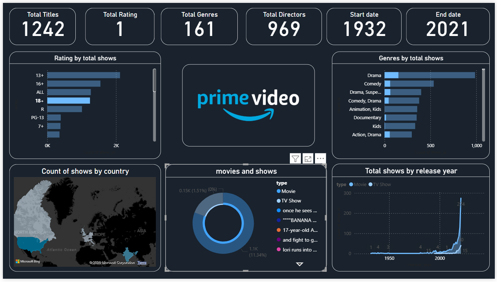
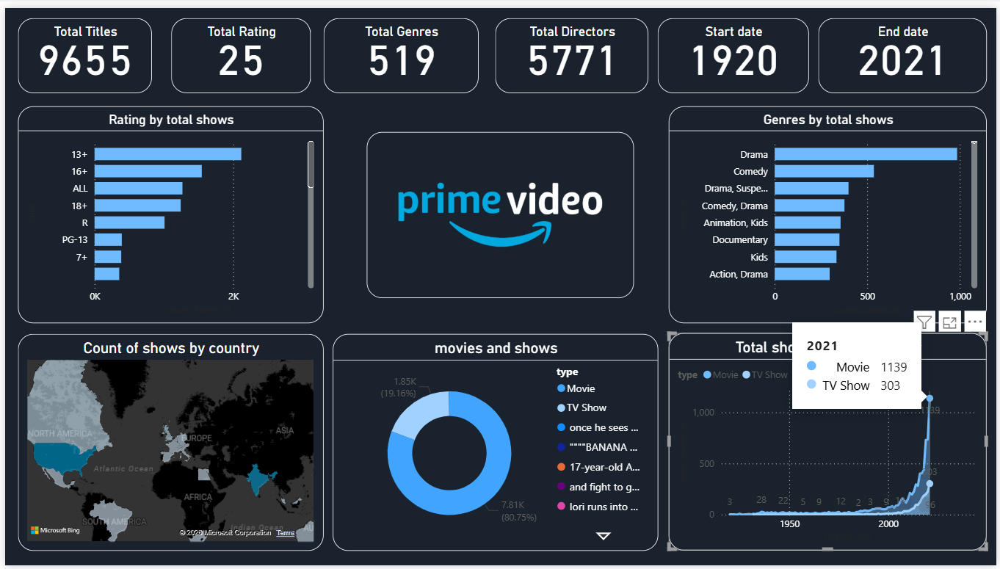

# Prime_Video_Dashboard
# 🎬 Amazon Prime Video Dashboard (Power BI)


---

## 📌 Project Overview

This project presents an interactive **Power BI Dashboard** built using the **Amazon Prime Titles dataset** from Kaggle.

The dashboard helps analyze content distribution, genres, ratings, and trends across the Amazon Prime platform, enabling better understanding of streaming data.

---

## 🎯 Objectives

- Analyze Movies vs TV Shows distribution  
- Identify trends based on release year  
- Explore genre popularity  
- Understand country-wise content distribution  
- Build an interactive dashboard for insights  

---

## 📊 Dataset Information

- **Source:** Kaggle (Amazon Prime Titles Dataset)  
- **Features:**
  - Title  
  - Type (Movie/TV Show)  
  - Genre  
  - Director  
  - Cast  
  - Country  
  - Release Year  
  - Rating  
  - Duration  

---

## 🛠️ Tools & Technologies

- Power BI  
- Power Query (Data Cleaning & Transformation)  
- Data Visualization  

---

## 📸 Dashboard Preview

### 🔹 Overview Dashboard


### 🔹 Insights Dashboard


---

## 📈 Key Insights

- Majority of content is Movies compared to TV Shows  
- Drama and Comedy are the most dominant genres  
- Content availability varies across countries  
- Significant growth in content after 2010  
- Ratings distribution shows platform content diversity  

---

## 📂 Project Structure

```
dashboard/
│
├── Prime_Video_Dashboard.pbix
├── dataset.csv
├── images/
│   ├── dashboard1.png
│   ├── dashboard2.png
├── README.md
```

---

## 🚀 How to Use

1. Download the `.pbix` file  
2. Open it in **Power BI Desktop**  
3. Interact with filters and visuals  

---

## 🌟 Future Improvements

- Deploy dashboard using Power BI Service  
- Add real-time data integration  
- Enhance visuals with advanced analytics  
- Include user engagement metrics  

---

## 👩‍💻 Author

**Pranjal Borse**  
Final Year Engineering Student (Data Science)

---

## ⭐ Support

If you like this project, give it a ⭐ on GitHub!
